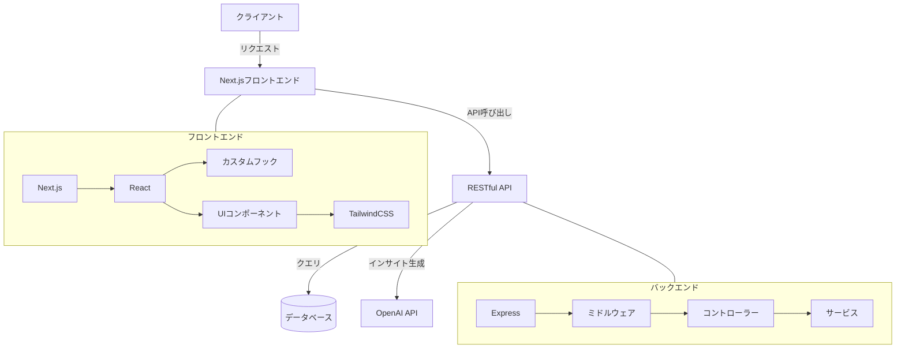
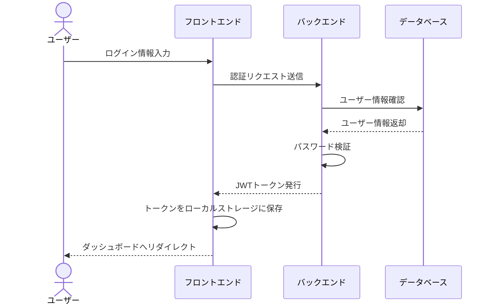
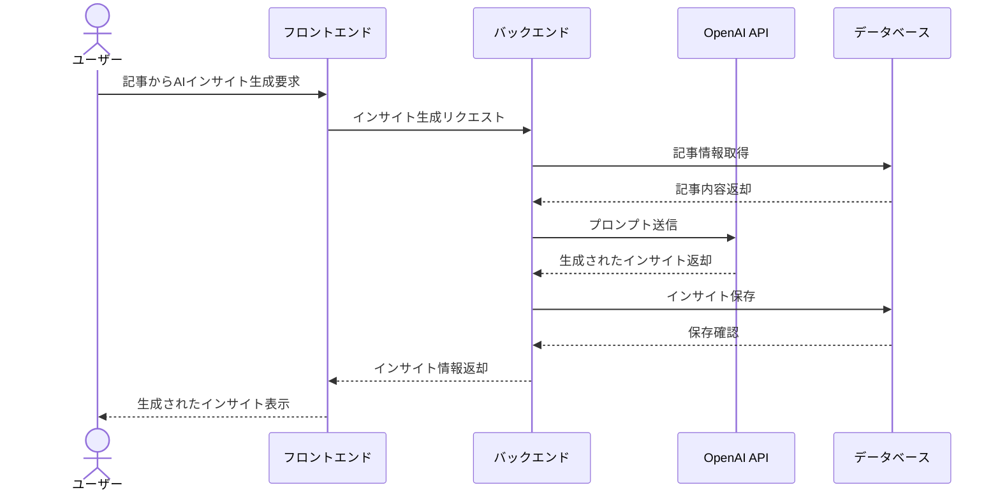
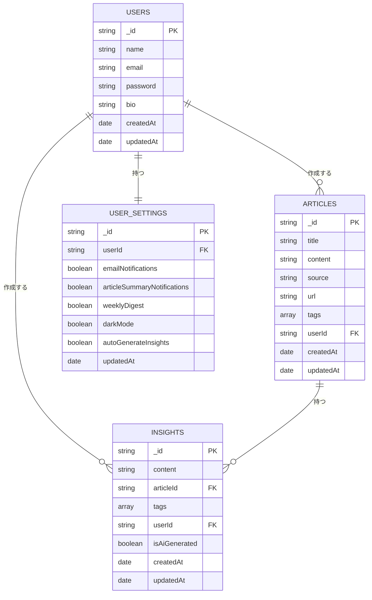

# インサイトマスター

記事を読んで得た洞察（インサイト）を管理し、AIによる分析と比較ができるアプリケーション

## 概要

「インサイトマスター」は、記事や書籍から得られる洞察を効率的に管理し、自分の考察をAIによる分析と比較することで、クリティカルシンキング能力を向上させるためのWebアプリケーションです。

主な機能:
- 記事の登録と管理
- 記事から得られたインサイト（洞察）の記録
- AIによる記事の分析と洞察の提案
- 自分のインサイトとAIの分析結果の比較
- 統計情報の表示とインサイトの振り返り

## セットアップ

### 必要条件

- Node.js 18以上
- MongoDB
- OpenAI API キー

### インストール手順

1. リポジトリをクローン
```
git clone https://github.com/yourusername/insight-master.git
cd insight-master
```

2. 依存パッケージのインストール
```
npm install
```

3. 環境変数の設定
`.env.local`ファイルを作成し、以下の内容を設定します:

```
# MongoDB設定
MONGODB_URI=mongodb://localhost:27017
MONGODB_DB_NAME=insightmaster

# JWT設定
JWT_SECRET=your_jwt_secret_key
JWT_EXPIRATION=7d

# OpenAI API設定
OPENAI_API_KEY=your_openai_api_key
OPENAI_BASE_URL=https://api.openai.com/v1
OPENAI_MODEL=gpt-4
```

4. アプリケーションの起動
```
npm run dev
```

5. ブラウザで `http://localhost:3000` にアクセス

## API ドキュメント

### 認証関連

#### ユーザー登録
- **エンドポイント**: POST /api/auth/register
- **説明**: 新しいユーザーを登録します
- **リクエスト例**:
```json
{
  "name": "テストユーザー",
  "email": "test@example.com",
  "password": "P@ssw0rd123",
  "confirmPassword": "P@ssw0rd123"
}
```

#### ログイン
- **エンドポイント**: POST /api/auth/login
- **説明**: 登録済みユーザーでログインします
- **リクエスト例**:
```json
{
  "email": "test@example.com",
  "password": "P@ssw0rd123"
}
```

### 記事関連

#### 記事一覧取得
- **エンドポイント**: GET /api/articles
- **説明**: ユーザーの記事一覧を取得します
- **クエリパラメータ**:
  - `limit`: 取得件数 (デフォルト: 10)
  - `skip`: スキップ件数 (デフォルト: 0)
  - `status`: 記事のステータス (published/draft)
  - `tag`: タグでフィルタリング
  - `search`: キーワード検索

#### 記事作成
- **エンドポイント**: POST /api/articles
- **説明**: 新しい記事を作成します
- **リクエスト例**:
```json
{
  "title": "テスト記事",
  "content": "これはテスト記事の内容です。",
  "source": "https://example.com/article",
  "category": "テクノロジー",
  "tags": ["AI", "Web開発"],
  "status": "draft"
}
```

#### 記事詳細取得
- **エンドポイント**: GET /api/articles/:id
- **説明**: 特定の記事の詳細情報を取得します

#### 記事更新
- **エンドポイント**: PUT /api/articles/:id
- **説明**: 記事情報を更新します

#### 記事削除
- **エンドポイント**: DELETE /api/articles/:id
- **説明**: 記事を削除します

### インサイト関連

#### インサイト追加
- **エンドポイント**: POST /api/articles/:id/insights
- **説明**: 記事にインサイトを追加します
- **リクエスト例**:
```json
{
  "content": "この記事から学んだことは...",
  "category": "根本原因",
  "evidence": "記事の第3段落では..."
}
```

#### インサイト一覧取得
- **エンドポイント**: GET /api/articles/:id/insights
- **説明**: 記事のインサイト一覧を取得します

#### インサイト更新
- **エンドポイント**: PUT /api/articles/:id/insights/:insightId
- **説明**: 特定のインサイトを更新します

#### インサイト削除
- **エンドポイント**: DELETE /api/articles/:id/insights/:insightId
- **説明**: 特定のインサイトを削除します

### AI分析関連

#### 記事分析
- **エンドポイント**: POST /api/articles/:id/analyze
- **説明**: 記事をAIで分析し、インサイトを生成します
- **リクエスト例**:
```json
{
  "analysisLevel": "detailed"
}
```

#### インサイト比較
- **エンドポイント**: POST /api/articles/:id/compare
- **説明**: ユーザーのインサイトとAI生成インサイトを比較します

### ユーザー関連

#### プロフィール取得
- **エンドポイント**: GET /api/users/me
- **説明**: 現在のユーザープロフィールを取得します

#### プロフィール更新
- **エンドポイント**: PUT /api/users/me
- **説明**: ユーザープロフィールを更新します

#### パスワード変更
- **エンドポイント**: PUT /api/users/me/password
- **説明**: ユーザーのパスワードを変更します

#### 統計情報取得
- **エンドポイント**: GET /api/users/me/stats
- **説明**: ユーザーの統計情報（記事数、インサイト数など）を取得します

### システム関連

#### ヘルスチェック
- **エンドポイント**: GET /api/health
- **説明**: APIのヘルスステータスを確認します

## ライセンス

MIT

## 開発者

Your Name

## システム図

インサイトマスターのシステム構造を理解するために、以下の図を追加しました。

### システム構成図



### シーケンス図

#### 認証プロセス



#### インサイト生成プロセス



### ユースケース図

```mermaid
graph TB
    User((ユーザー))
    Admin((管理者))
    
    subgraph "認証機能"
    UC1[登録]
    UC2[ログイン]
    UC3[ログアウト]
    UC4[パスワード変更]
    end
    
    subgraph "記事管理"
    UC5[記事追加]
    UC6[記事編集]
    UC7[記事削除]
    UC8[記事検索]
    UC9[記事閲覧]
    end
    
    subgraph "インサイト管理"
    UC10[手動インサイト追加]
    UC11[AIインサイト生成]
    UC12[インサイト編集]
    UC13[インサイト削除]
    UC14[インサイト検索]
    end
    
    subgraph "プロフィール管理"
    UC15[プロフィール表示]
    UC16[プロフィール編集]
    UC17[アカウント削除]
    end
    
    subgraph "データ可視化"
    UC18[アクティビティグラフ閲覧]
    UC19[カテゴリ分布閲覧]
    UC20[統計情報閲覧]
    end
    
    User --> UC1
    User --> UC2
    User --> UC3
    User --> UC4
    User --> UC5
    User --> UC6
    User --> UC7
    User --> UC8
    User --> UC9
    User --> UC10
    User --> UC11
    User --> UC12
    User --> UC13
    User --> UC14
    User --> UC15
    User --> UC16
    User --> UC17
    User --> UC18
    User --> UC19
    User --> UC20
    
    Admin --> UC1
    Admin --> UC2
    Admin --> UC3
    Admin --> UC4
    Admin --> UC5
    Admin --> UC6
    Admin --> UC7
    Admin --> UC8
    Admin --> UC9
    Admin --> UC10
    Admin --> UC11
    Admin --> UC12
    Admin --> UC13
    Admin --> UC14
    Admin --> UC15
    Admin --> UC16
    Admin --> UC17
    Admin --> UC18
    Admin --> UC19
    Admin --> UC20
```



### ERダイアグラム



これらの図を通じて、インサイトマスターのシステム構造、主要なプロセスフロー、ユーザーの利用可能機能、データモデルの関係が理解できます。このアプリケーションは、ユーザーが記事を管理し、その記事からインサイトを抽出・管理できるプラットフォームであり、AIを活用してインサイト生成も支援します。
